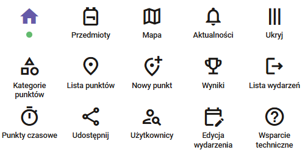
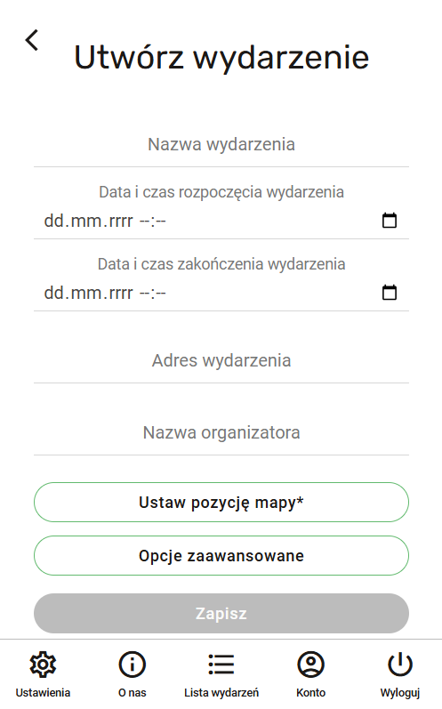
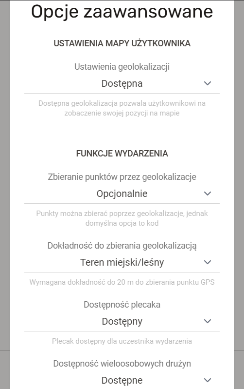

# Zarządzanie wydarzeniami

Autor: **Emil Twardzik**

Wydarzenia to funkcjonalność pozwalająca stworzyć własną instancję gry terenowej.

## Podstawowe informacje

### Role w wydarzeniu

1. **Administrator** - osoba zarządzająca wydarzeniem, mająca dostęp do wszystkich funkcji aplikacji i pełniąca rolę kontrolną w wydarzeniu.
2. **Twórca** - osoba zarządzająca wydarzeniem, mająca dostęp do większości funkcji związanych z administracją wydarzenia.
3. **Obserwator** - osoba biorąca pasywny udział w wydarzeniu, nie biorąca udziału w rozgrywce lub administracji wydarzenia, ale mająca dostęp do informacji o stanie gry i jej uczestnikach.
4. **Lider drużyny** - osoba biorąca czynny udział w wydarzeniu, będąca odpowiedzialna za dodanie członków zespołu oraz zbieranie punktów
5. **Uczestnik** - osoba biorąca czynny udział w wydarzeniu, zarejestrowana w danym wydarzeniu oraz danej drużynie

### Menu wydarzenia

Perspektywa twórcy wydarzenia.

- **Przedmioty** - plecak z przedmiotami, które uczestnicy zdobywają oraz mogą użyć w trakcie gry,
- **Mapa** - mapa wydarzenia z bieżącym położeniem punktów,
- **Aktualności** - informacje dotyczące obecnego wydarzenia przychodzące w formie powiadomień,
- **Kategorie punktów** - lista rodzajów punktów w obecnym wydarzeniu,
- **Lista punktów** - lista wszystkich indywidualnych punktów istniejących w obecnym wydarzeniu,
- **Nowy punkt** - dodanie nowego punktu do wydarzenia (tylko dla ról zarządzających wydarzeniem),
- **Wyniki** - zestawienie drużyn oraz uczestników wraz ze zdobytymi przez nich punktami,
- **Lista wydarzeń** - powrót do widoku startowego z listą wydarzeń,
- **Punkty czasowe** - lista punktów, których widoczność oraz możliwość zebrania jest ograniczona czasowo,
- **Udostępnij** - udostępnienie zaproszenia do wydarzenia innym,
- **Użytkownicy** - lista uczestników wydarzenia,
- **Edycja wydarzenia** - zmiana początkowych ustawień wydarzenia (tylko dla ról zarządzających wydarzeniem),
- **Wsparcie techniczne** - przekierowanie do zewnętrznej strony z formularzem kontaktowym do twórców aplikacji

## Tworzenie wydarzenia

### Wstęp

1. Naciśnij przycisk "Utwórz wydarzenie" w widoku głównym aplikacji.
2. Wypełnij podane pola w formularzu tworzenia wydarzenia.

###
