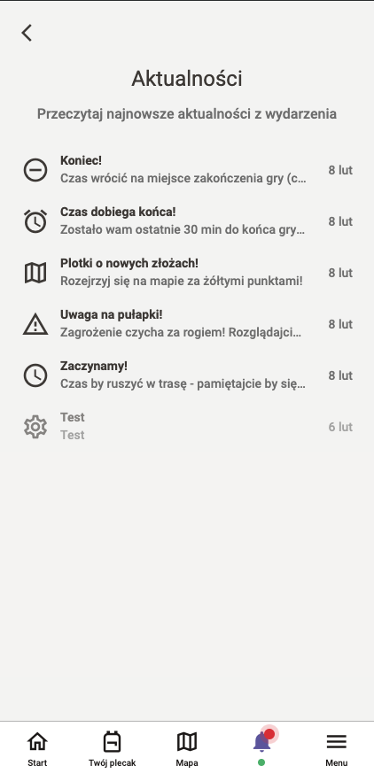
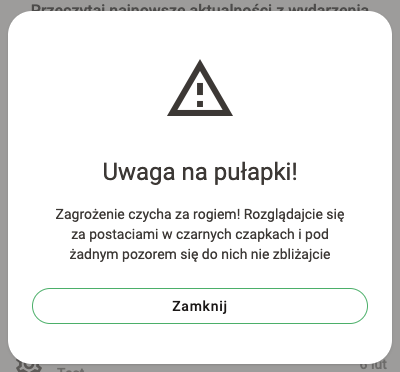
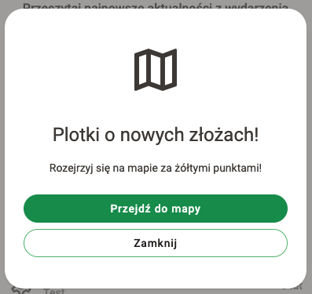
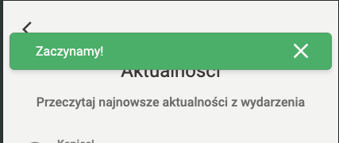
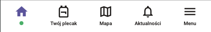
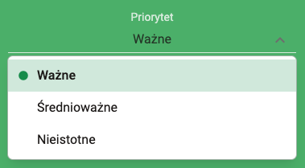
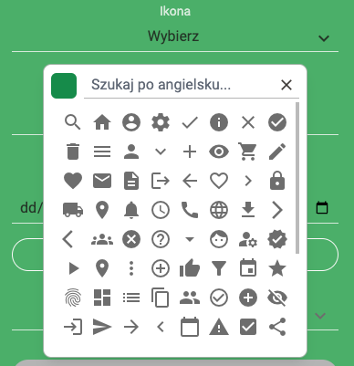
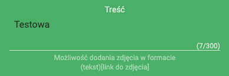
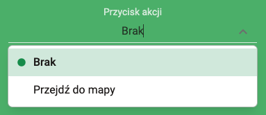
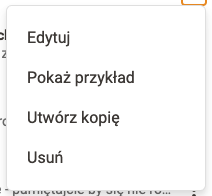

# Aktualności w wydarzeniu (wkrótce dostępne)
Autor: **Dominik Betka**

Aktualności w wydarzeniu to funkcjonalność, która pozwala na wysyłanie powiadomień do uczestników wydarzenia.
Dzięki temu uczestnicy będą mogli otrzymywać informacje o zmianach w wydarzeniu, nowych punktach, przedmiotach, zadaniach oraz innych ważnych informacjach.

## Przykładowy wygląd aktualności

### Lista aktualności i zarządzania nimi
 

### Przykładowe aktualności pokazane uczestnikom
  

___

## Jak wysłać aktualności?

##### 1. Naciśnij przycisk "Aktualności" w dolnym menu.  
   
##### 2. Naciśnij przycisk "Dodaj nową aktualność".  
##### 3. Wypełnij formularz i zapisz:
   - **Tytuł** (wymagane): krótka nazwa aktualności (maksymalnie 45 znaków)
   - **Priorytet** (wymagane): wybierz priorytet aktualności
     - **Nieistotne**: uczestnicy zostaną poinformowani o nim tylko w formie migającej kropki na dzwonku powiadomień
     - **Średnioważne**: uczestnicy otrzymają powiadomienie w formie paska na górze ekranu, który zniknie po kilku sekundach
     - **Ważne**: uczestnicy otrzymają powiadomienie w formie wyskakującego okna z pełną treścią aktualności  
     
   - **Ikona** (wymagane): wybierz ikonę, która opisze aktualność – dostępna jest wyszukiwarka ikon po angielsku  
     
   - **Treść**: szczegółowy opis aktualności (maksymalnie 300 znaków). Można używać linków do stron internetowych oraz zdjęć w formacie `(tekst)[link do zdjęcia]`  
     
   - **Czas pojawienia się** (wymagane): wybierz datę i godzinę, kiedy aktualność ma się pojawić. Możesz zresetować datę po naciśnięciu w przycisk poniżej.
   - **Przycisk akcji**: dodaj przycisk, który po naciśnięciu przeniesie uczestnika do wybranego miejsca w aplikacji
     - **Mapa**: przeniesie uczestnika do mapy wydarzenia  
       

## Jak zarządzać aktualnościami?

##### 1. Naciśnij przycisk "Aktualności" w dolnym menu.  
   
##### 2. Naciśnij ikonę trzech kropek przy danej aktualności i wybierz jedną z poniższych opcji
   - **Edytuj**: zmień treść, priorytet, ikonę, czas pojawienia się oraz przycisk akcji aktualności
   - **Usuń**: usuń aktualność z wydarzenia
   - **Pokaż przykład**: zobacz szczegóły aktualności
   - **Utwórz kopię**: skopiuj aktualność  
   
